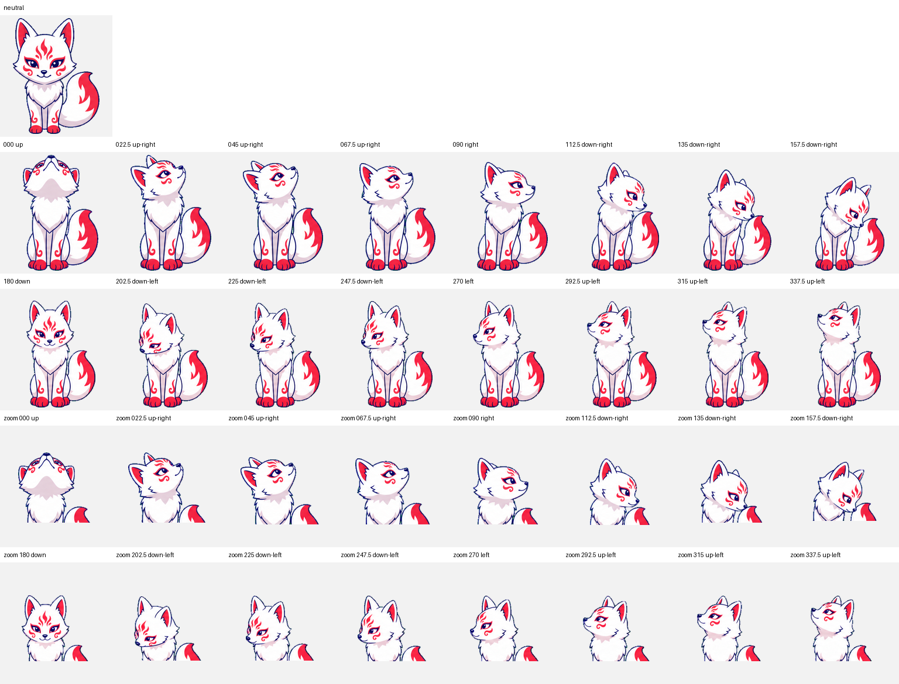

# White Kitsune Pet

White Kitsune is a Codex-compatible v2 guardian fox companion with nine standard animation rows and 16 clockwise look directions.



The [White Kitsune package](white-kitsune/) contains its `pet.json`, lossless `1536x2288` v2 `spritesheet.webp`, atlas metadata, generation request, deterministic validation, direction QA evidence, motion previews, fixed fur/vermilion palette contract, and measured consistency reports.

## Install

```bash
mkdir -p ~/.codex/pets/white-kitsune
cp white-kitsune/pet.json white-kitsune/spritesheet.webp ~/.codex/pets/white-kitsune/
```

The packaged atlas passes strict v2 validation with no errors or warnings.
