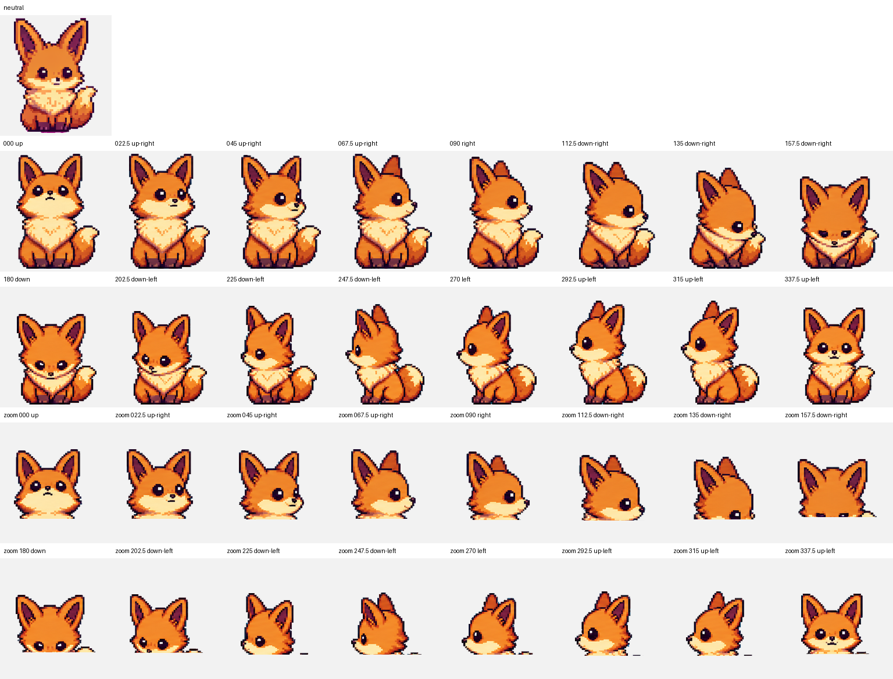

# Kitsune Pet

Kitsune is a Codex-compatible v2 pixel-art pet with nine standard animation rows and 16 clockwise look directions.



## Package

- `pet.json` — Codex pet manifest with `spriteVersionNumber: 2`
- `spritesheet.webp` — lossless `1536x2288` 8x11 atlas using `192x208` cells
- `atlas.json` — look-direction layout metadata
- `pet_request.json` — source identity, style, chroma key, and row contract
- `qa/` — deterministic validation, chroma report, contact sheets, direction semantics, blind-review evidence, continuity metrics, and motion previews

## Install

```bash
mkdir -p ~/.codex/pets/kitsune
cp pet.json spritesheet.webp ~/.codex/pets/kitsune/
```

The packaged atlas passes strict v2 validation with no errors or warnings. Both blind cardinal gates pass; reviewed warnings are limited to subtle secondary axes on intermediate directions.
