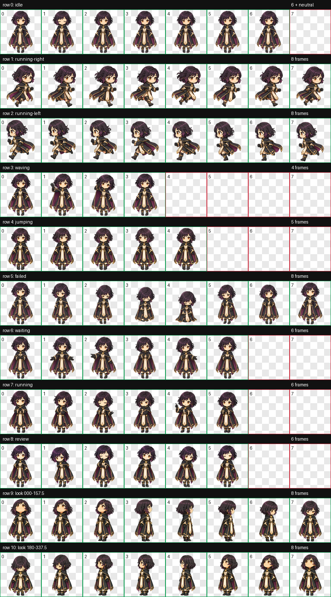
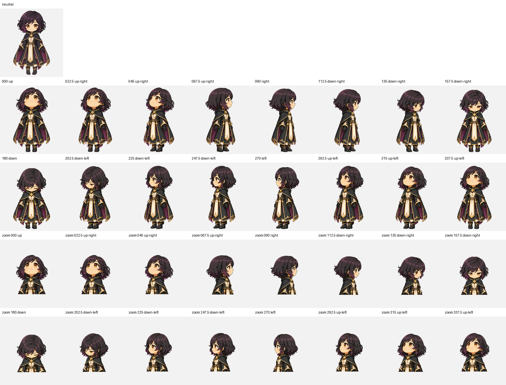

# Twilight Cleric

<p align="center">
  
  
  
</p>

Twilight Cleric is a fan-made Codex companion inspired by Shadowheart's dark-clad cleric fantasy in *Baldur's Gate 3*, reimagined as an original chibi light cleric. She is a gentle protector with dark hair, dark robes, warm golden eyes, and a little guiding light for long coding sessions.

## See her in motion

| Run right | Run left | Focus |
|:---:|:---:|:---:|
|  |  |  |

| Waiting for you | Reviewing | A difficult build |
|:---:|:---:|:---:|
|  |  |  |

## The complete animation set

The pet includes nine standard animation states and sixteen clockwise look directions. Her hover interaction keeps the same height and proportions as idle, so she looks around without shrinking.

<p align="center">
  
</p>

## Sixteen look directions

<p align="center">
  
</p>

## Install in Codex

From a clone of this repository:

```bash
mkdir -p ~/.codex/pets/twilight-cleric-stable
cp twilight-cleric/pet.json twilight-cleric/spritesheet.webp \
  ~/.codex/pets/twilight-cleric-stable/
```

Twilight Cleric is an original, unofficial fan creation and is not affiliated with or endorsed by Larian Studios, Wizards of the Coast, or OpenAI.
